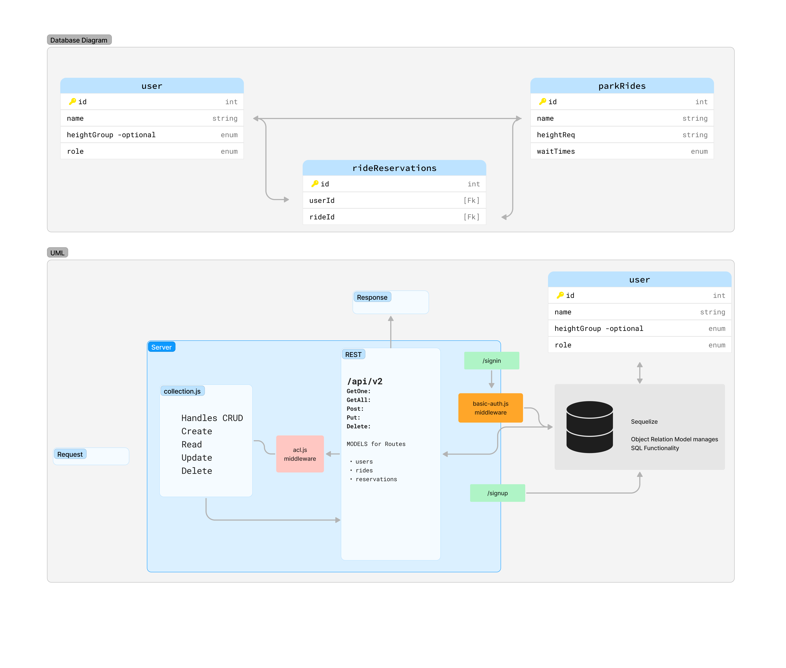

# Lab 09

## Project: RideTrackX

### Authors

- [Katherine "Kati" Lee](https://github.com/KatiLee)
- [Donna Ada](https://github.com/donnaada)

### Problem Domain

This project solves address the challenges faced by theme park guests trying to manage ride queues. This application allows the users to view all the rides at the parks, the wait times, as well as the height requirements. Users are able to create a login and submit and view their reservation requests for a specific ride.

### Links and Resources

- Previous Lab & Lecture Notes - Ryan Gallaway
- [Sequelize Documentation](https://sequelize.org/docs/v6/core-concepts/assocs/)

### Setup

- Clone repo, run `npm i`
- Make sure you have `Postgres` installed on your machine.
- Create a copy of the following `config.sample.json` and `.env.sample` and rename to `config.json` and `.env`.
- Modify `config.json` and `.env` with your the requested information ( anything inside the `< >` symbols.)
- Run `npm run db:create` to create a the datebase
- Run `nodemon` to start up the application

#### Enviromental (`.env`) Variables

- `PORT`: Port of your choice
- `DATABASE_URL`: Your postgres DB URL
- `SECRET`: Secret of your choosing

#### How to initialize/run your application

- `npm i` to initialize the application
- `nodemon` to run the application

#### Routes

- `/signup`
- `/signin`
- `/users`
- `/secret`
- `/api/v2/ride`
- `/api/v2/reservation`

#### Tests

- Tests coming soon

#### UML

